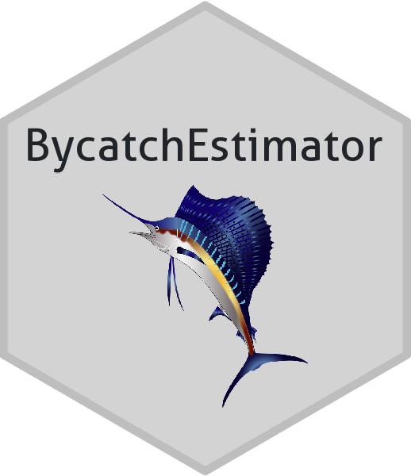

<!-- README.md is generated from README.Rmd. Please edit that file -->

# BycatchEstimator 

<!-- badges: start -->
<!-- badges: end -->

BycatchEstimator is used to estimate both total bycatch, calculated by
expanding a sample, such as an observer database, to total effort from
logbooks or landings records, and an annual index of abundance,
calculated only from the observer data.

BycatchEstimator uses both model-based and design-based procedures to
estimate total annual bycatch by expanding a sample, such as an observer
database, in relation to total effort from logbooks or landings records.
The model framework can also be used to estimate an annual index of
abundance, calculated only from the observer data. Using this tool,
bycatch estimation is carried out by running linear models based on
user-defined statistical distributions of observation error models
(e.g. delta-lognormal, and negative binomial) with predictor variables
(e.g., year, season, depth). The task of identifying a best
approximating model is addressed through a semi-automated model
selection process based on the user’s choice of information criteria
(AICc, AIC or BIC) and cross validation. Once a best approximating model
is identified, the standardized CPUE model is used to predict total
bycatch in all logbook trips and summing across trips. Design-based
estimates are made using a ratio estimator or a delta-lognormal
estimator with stratification variables specified by the user. This
bycatch estimation tool has been developed as an accessible R package.
See the User’s Guide under articles at
<https://ebabcock.github.io/BycatchEstimator/> for details.

## Installation

The code runs best in R studio. Before running the code for the first
time, install the latest versions of R and RStudio. The output figures
and tables are printed to a pdf file using R Markdown and the knitr
library, which outputs a LaTex file; therefore, you must have a LaTex
program installed, such as TinyTex (<https://yihui.org/tinytex/>).

You can install the development version of BycatchEstimator from
[GitHub](https://github.com/) with:

``` r
# install.packages("devtools")
devtools::install_github("ebabcock/BycatchEstimator")
```

For more help with installation, see the Installation Guide
<https://ebabcock.github.io/BycatchEstimator/articles/InstallationGuide.html>
Also, see the video tutorial at
<https://miami.box.com/s/sjqwj3c1v1tcv4y3n169u3x5bs18rir2>

## Getting started

Due to a complication in coding, the user must load `library(MuMIn)` in
addition to `library(BycatchEstimator)`.

``` r
library(BycatchEstimator)
library(MuMIn)
```

## LLSIM Example

To demonstrate its use, example data sets are included in this R
package. In this example, we will use data sets from LLSIM (Goodyear
2021).

### Logbook data

Simulation of longline fleets with LLSIM was conducted using three
idealized fleets as described by Goodyear (2021). These fleets are a
USA-like fleet (fleet 1), Japan-like fleet (fleet 2) and a Brazil-like
fleet (fleet 3). The simulated data set included three fleets, with data
spanning from 1990 to 2018 to reflect the approximate period for which
observer coverage has been established. The species distribution model
(SDM) and longline simulator generates a 3-dimensional distribution of
blue marlin and swordfish throughout the Atlantic Ocean based on the
habitat preferences of the species. Simulated longline sets are then
generated by distributing hooks throughout the habitat of the species,
consistent with the distribution, gear, hooks between floats, use of
lightsticks and other characteristics of historical longline fishing
fleets. While LLSIM initially produces set-level catches, both logbooks
and observer databases were allocated by trip (Babcock and Goodyear
2021). Sets are allocated to trip if they were in the same gear, month
and spatial area (5 x 5 squares). Trips with more than 100 sets were
randomly allocated to different trips so that the median trips had about
20 sets.

``` r
LLSIM_BUM_Example_logbook
```

### Observer program data

Observer program data are generated by passing the trip-level logbook
data to an observer program sub-model. The observer sub-model assumes
that observer coverage is randomly assigned to trips, with 5% coverage
of trips. The entire trip is assumed to be observed.

``` r
LLSIM_BUM_Example_observer
```

### Model setup

The first step in bycatch estimation is setup the input file and review
and verify the data. Notice that returned value from `bycatchSetup` is
assigned as an object that will be used in a subsequent step. This step
also produces output that is saved to the working directory for the user
to review. Review is essential to ensure that data have been correctly
formatted and interpreted in model setup.

``` r

setupObj<-bycatchSetup(
 modelTry = c("TMBnbinom1","TMBtweedie"),
 obsdat = droplevels(LLSIM_BUM_Example_observer[LLSIM_BUM_Example_observer$Year>2010 &LLSIM_BUM_Example_observer$fleet==2,]),
  logdat = droplevels(LLSIM_BUM_Example_logbook[LLSIM_BUM_Example_logbook$Year>2010 & LLSIM_BUM_Example_logbook$fleet==2,]),
  yearVar = "Year",
  obsEffort = "hooks",
  logEffort = "hooks",
  logUnsampledEffort = "unsampledEffort",
  includeObsCatch  = TRUE,
  matchColumn = "trip",
  factorNames = c("Year","area"),
  randomEffects= NULL,
 randomEffects2= NULL,
 EstimateIndex = TRUE,
  EstimateBycatch = TRUE,
  logNum = NA,
  sampleUnit = "trips",
  complexModel = formula(y~Year+area),
  simpleModel = formula(y~Year),
  indexModel = formula(y~Year),
  designMethods =c("Ratio","Delta"),
  designVars=c("Year","area"),
  designPooling = FALSE,
  minStrataUnit=1,
  baseDir = getwd(),
  runName = "LLSIMBUMtripExample",
  runDescription = "LLSIm BUM by trip, with 5% observer coverage including observed catch in totals",
  common = c("Swordfish","Blue marlin")[2],
  sp = c("Xiphias gladius","Makaira nigricans")[2],
  obsCatch = c("SWO","BUM")[2],
  catchUnit = "number",
  catchType = "catch"
)
```

### Optional step

The output produced in step one includes the object returned by
`bycatchSetup`. The naming convention for this object ends
`_BycatchModelSpecification.rds`, as shown below. Thus, any model setup
can be stored and later retrieved for analysis.

``` r
setupObj<-readRDS(file=paste0(getwd(), paste("/Output", "LLSIMBUMtripExample"),"/", Sys.Date(),"_BycatchModelSpecification.rds"))
```

### Model fitting

Estimation of bycatch and/or index of abundance is carried out by using
the function `bycatchFit`. This function requires an object produced by
`bycatchSetup` as well as several other arguments.

``` r
bycatchFit(
  setupObj = setupObj,
  selectCriteria = "BIC",
  DoCrossValidation = FALSE,
  DredgeCrossValidation = FALSE,
  ResidualTest = FALSE,
  CIval = 0.05,
  VarCalc = "None",
  useParallel = TRUE,
  nSims = 1000,
  baseDir = getwd(),
  plotValidation = FALSE,
  trueVals = NULL,
  trueCols = NULL,
  doReport = TRUE
)
```

## References

Goodyear, C.P. 2021. Development of new model fisheries for simulating
longline catch data with LLSIM. Collect. Vol. Sci. Pap. ICCAT, 78(5):
53-62

Babcock, E.A. and C. P. Goodyear. 2021. Testing a bycatch estimation
tool using simulated blue marlin longline data. ICCAT Collective Volume
of Scientific Papers, 78(5): 179-189.
