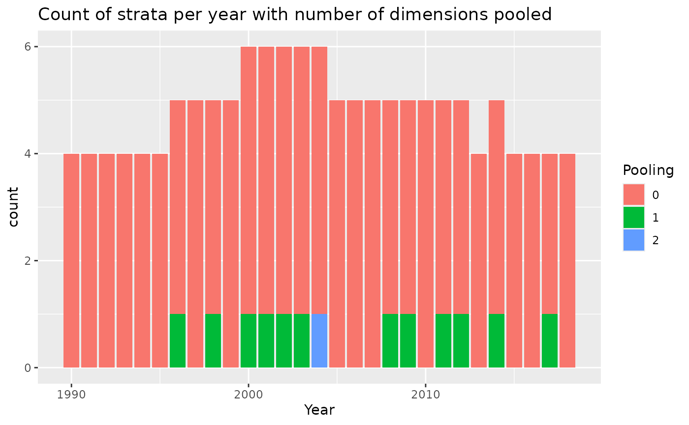
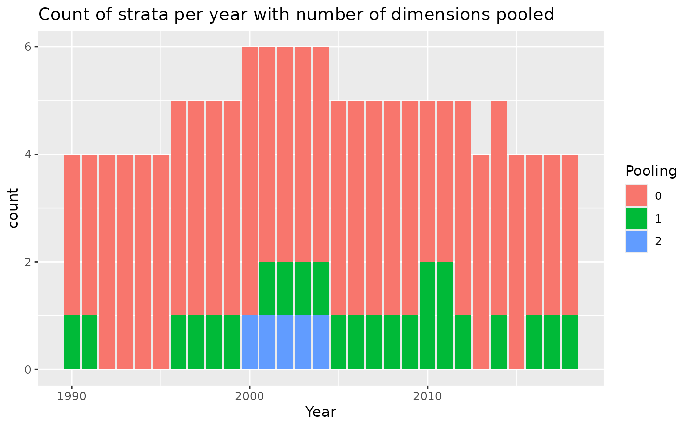
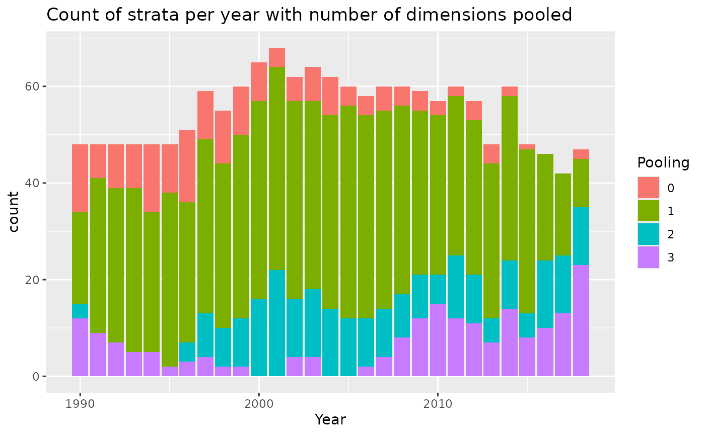
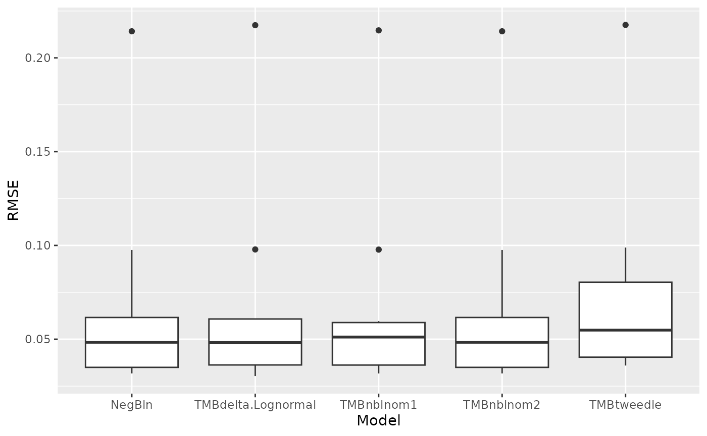
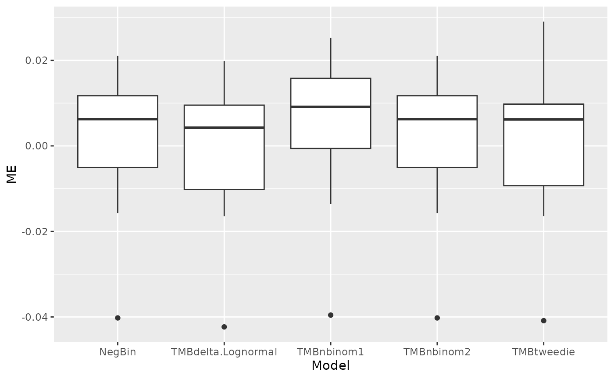
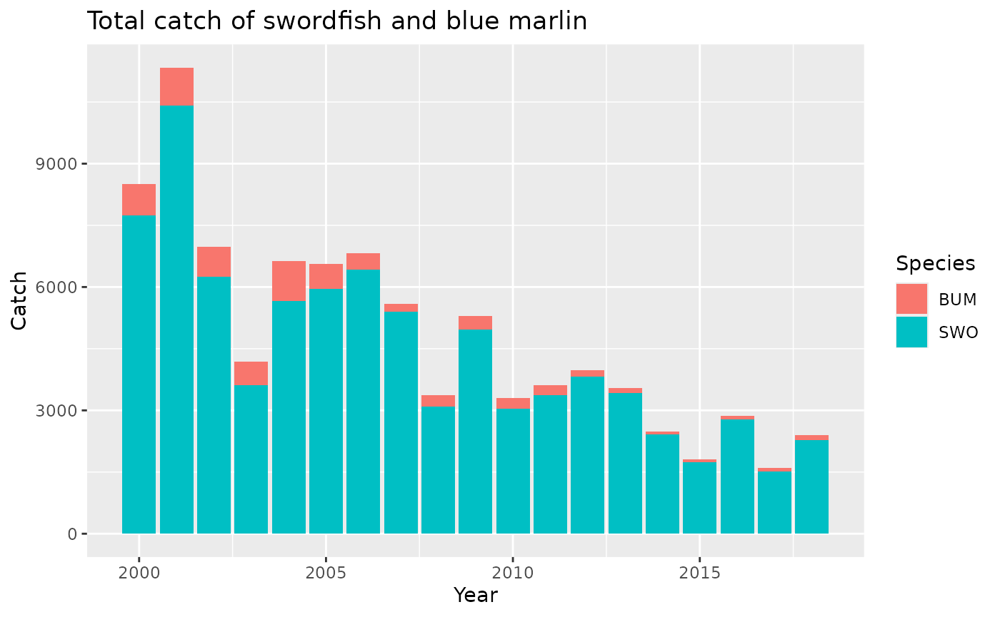

# Material from 2025 ICCAT Training Course

## Introduction and Agenda

This document includes the slides and R tutorials from the ICCAT
BycatchEstimator training in Panama City, Panama in July, 2025. The
slides and tutorials are listed in the order they were presented.

[Agenda](https://acrobat.adobe.com/id/urn:aaid:sc:US:8be9a9ab-4cec-4358-8973-7cf1f8beaeaf)

## Presentation 1. Overview of the BycatchEstimator R Package

[Slides for
overview](https://acrobat.adobe.com/id/urn:aaid:sc:US:e752e23f-2d42-4b73-8711-9c765cea9388)

## Tutorial 1. Introduction to the BycatchEstimator Tool

### Install and load the library.

Start by loading the libraries, after installing them if needed. Note
that BycatchEstimator will open all the other libraries it needs,
including tidyverse. For more guidance, see here:
<https://ebabcock.github.io/BycatchEstimator/articles/InstallationGuide.html>

``` r
#devtools::install_github("ebabcock/BycatchEstimator")
library(BycatchEstimator)
library(MuMIn)
```

### Look at format of the input data.

For bycatch estimation, there are two data sources, the observer data,
which has one row per sample unit (sets or trips) and the logbook data.
For CPUE standardization, only the observer data is needed.

The package includes some simulated longline observer data from LLSIM,
and a toy example data set. This is the toy data:

``` r
summary(obsdatExample)
```

    ##       EW                season           Year       sampled.sets     
    ##  Length:394         Min.   :1.000   Min.   :2009   Min.   :  0.7347  
    ##  Class :character   1st Qu.:1.000   1st Qu.:2011   1st Qu.: 17.9600  
    ##  Mode  :character   Median :1.000   Median :2013   Median : 22.4808  
    ##                     Mean   :1.398   Mean   :2013   Mean   : 30.1655  
    ##                     3rd Qu.:2.000   3rd Qu.:2015   3rd Qu.: 46.4658  
    ##                     Max.   :2.000   Max.   :2018   Max.   :107.7441  
    ##      Catch       
    ##  Min.   : 0.000  
    ##  1st Qu.: 0.000  
    ##  Median : 0.000  
    ##  Mean   : 1.109  
    ##  3rd Qu.: 0.000  
    ##  Max.   :33.000

``` r
dim(obsdatExample)
```

    ## [1] 394   5

This is trip by trip observer data from a benthic longline fishery. The
variables we need are *Catch*, which is bycatch of a species,
*sampled.sets*, which is the unit of effort, and the variables *Year*,
*EW* and *season*, which will define the stratification for the
design-based estimate and serve as predictor variables for the
model-base estimates. CPUE would be in terms of *Catch/sampled.sets*.

The corresponding logbook data is here:

``` r
summary(logdatExample)
```

    ##       sets               Year          season           EW           
    ##  Min.   :  0.4343   Min.   :2009   Min.   :1.000   Length:7794       
    ##  1st Qu.: 13.1870   1st Qu.:2011   1st Qu.:1.000   Class :character  
    ##  Median : 25.3512   Median :2013   Median :1.000   Mode  :character  
    ##  Mean   : 28.2885   Mean   :2013   Mean   :1.415                     
    ##  3rd Qu.: 38.4678   3rd Qu.:2016   3rd Qu.:2.000                     
    ##  Max.   :529.8817   Max.   :2018   Max.   :2.000                     
    ##      trips  
    ##  Min.   :1  
    ##  1st Qu.:1  
    ##  Median :1  
    ##  Mean   :1  
    ##  3rd Qu.:1  
    ##  Max.   :1

``` r
dim(logdatExample)
```

    ## [1] 7794    5

The logbook data must include all the effort for which bycatch estimates
are needed (i.e.the whole fleet). This logbook data contains one row per
trip, the same as the observer data. The logbook data could also be
aggregated, with a column giving the sample size per row (here *trips*
is 1 for all rows). The logbook data must include effort in the same
units as the observer data (in this case *sets*), and the same predictor
variables (in this case *Year*, *EW*, and *season*).

### bycatchSetup

The first step in bycatch estimation is setup the input file and review
and verify the data. Notice that returned value from `bycatchSetup` is
assigned as an object that will be used in subsequent steps for applying
design-based estimators (`bycatchDesign`) and model fitting
(`bycatchFit`). This step produces output that is saved to the working
directory for the user to review. The inputs to the `bycatchSetup`
function are explained in the help file. To see what the function does:

``` r
?bycatchSetup
```

The help file explains all the inputs. Read through them to see what
options there are. The User’s Guide goes into much more detail.

For now, let’s run the simulated example data. First set the working
directory to where you want the outputs to be, for example:

``` r
# Commented out so it will not run, because every computer has a different path. 
# setwd("~/Tutorials")
```

Now copy and paste this example to the console or an R script and run
it:

``` r
setupObj<-bycatchSetup(
  obsdat = obsdatExample,
  logdat = logdatExample,
  yearVar = "Year",
  obsEffort = "sampled.sets",
  logEffort = "sets",
  obsCatch = "Catch",
  catchUnit = "number",
  catchType = "catch",
  logNum = NA,
  sampleUnit = "trips",
  factorVariables = c("Year","EW","season"),
  numericVariables = NA,
  EstimateBycatch = TRUE,
  baseDir = getwd(),
  runName = "Simulated",
  runDescription = "Simulated example species",
  common = "Simulated species",
  sp = "Genus species",
  reportType = "html"
)
```

The tool has printed output files in the directory you specified with
baseDir and a subdirectory named runName. In this example, it created
the folder “OutputSimulated”, and inside that a subfolder named
“Simltdspcscatch”, which is an abbreviation of the species common name
and catch type. In the subfolder, you will find an html report with the
results, and another subfolder named “Setup files”.

The html file called “SimltdspcscatchDataChecks.html” contains summary
figures and tables showing the sample size and presence/absence of the
bycatch species across levels of predictor variables, observer coverage
levels, raw trends in CPUE, and a summary of the available data. It also
indicates if there are missing data or NAs with warning messages at the
top of the file. The tool also produced csv files inside the
“bycatchSetup files” folder. These contain data summaries by Year and
factor variables. For more information on these see Appendix in the User
Guide.

At this point, if the fishery and/or the observer coverage is low, check
to make sure that you have at least some positive observations in each
year. If any year has no positive observations, the delta models will
not work. This example has only 1 positive observation in each of the
last two years (2017 and 2018), so it will not crash, but we can expect
some models to perform badly. The last two columns of the data summary
table (Table 2) are a ratio estimator that is unstratified (except by
year) as a quick reality check on the expected magnitude of the total
bycatch (columns “Cat” and “Cse”).

### bycatchDesign

The `bycatchDesign` function generates design-based estimates of total
bycatch, e.g. using a stratified ratio estimator. You don’t have to run
this function if you are only using model-based estimates (see below).
The inputs to `bycatchDesign` are explained in the help file:

``` r
?bycatchDesign
```

You can use this code:

``` r
bycatchDesign(
setupObj = setupObj,
designScenario = "withPooling",
designMethods = c("Ratio", "Delta"),
designVars = c("Year","season"),
designPooling = TRUE,
poolTypes=c("adjacent","all"),
pooledVar=c(NA,NA),
adjacentNum=c(1,NA),
minStrataUnit = 1
)
```

The tool has now printed another html file named
“SimltdspcscatchwithPoolingDesignResults.html”. The available estimator
types are a stratified ratio estimator, and a stratified design-based
delta-lognormal estimator. It also created the subfolder “Design files”,
which contain csv files with summaries and a file with “withPooling” in
the name, that gives some information about how much pooling was done.
In this example, pooling was only requested if there was less than one
sample unit (trip) and only to adjacent years and all season, which was
not enough to eliminate the zero estimates in some strata (see
SimltdspcscatchwithPoolingDesignStrata.csv). We will return to this
later.

### bycatchFit

The `bycatchFit` function does all the model-based estimates.

``` r
?bycatchFit
```

This function has a few more specifications regarding setting up model
variables, model selection (which information criterion to use), use of
random effects, etc. This function uses the information criteria to find
the best set of predictor variables for each kind of model listed in
modelTry. It can also do cross validation if desired. It prints out the
model based estimates, diagnostics, and selection criteria.

``` r
bycatchFit(
setupObj = setupObj,
modelScenario = "model1",
complexModel = formula(y~(Year+season)^2),
simpleModel = formula(y~Year),
indexModel = formula(y~Year),
modelTry = c("Delta-Lognormal","TMBnbinom2"),
randomEffects = NULL,
randomEffects2 = NULL,
selectCriteria = "BIC",
DoCrossValidation = TRUE,
CIval = 0.05,
VarCalc = "Simulate",
useParallel = TRUE,
nSims = 1000
)
```

There will now be a html file named
“Simltdspcscatchmodel1ModelResults.html” in the output directory that
includes all the figures and plots. In addition, all the model outputs
are printed to .csv files for later use inside the folder “Fit files”.

## Presentation 2. Data setup and data checks

[Slides for data setup and data
checks](https://acrobat.adobe.com/id/urn:aaid:sc:US:d96970ee-ffe1-4f29-ba58-61e2423d2058)

## Tutorial 2. Data setup and data checks with the bycatchSetup function

This tutorial explains what outputs are produced after running
bycatchSetup and how to interpret them (what to look out for in terms of
potential issues with the data). First load the libraries:

``` r
# devtools::install_github("ebabcock/BycatchEstimator")  #Make sure library is installed and up to date
library(BycatchEstimator)
library(MuMIn)
library(dplyr)
library(ggplot2)
```

We will use simulated longline data from Phil Goodyear’s species
distribution and longline fishery simulator. The data in both the
logbook and observer data are at trip-by-trip. There is a variable
called *trip* which can be used to match the sampled trips in the
observer data to the corresponding trips in the logbook.

``` r
print(head(LLSIM_BUM_Example_observer))
```

    ## # A tibble: 6 × 22
    ##    ...1 trip    Year month  gear light fleet  bait  hook hooks  sets   SWO   BUM
    ##   <dbl> <chr>  <dbl> <dbl> <dbl> <dbl> <dbl> <dbl> <dbl> <dbl> <dbl> <dbl> <dbl>
    ## 1     2 10.19…  1990     4    10     1     1     2     4  0.5      1     4     0
    ## 2     3 10.19…  1990     7    10     1     1     2     4  4.5      9    31     0
    ## 3     4 10.19…  1990     8    10     1     1     2     4  1.15     2     7     0
    ## 4     5 10.19…  1991     2    10     1     1     2     4  0.5      1     2     0
    ## 5     6 10.19…  1992    10    10     1     1     2     4  1.2      2     7     0
    ## 6     7 10.19…  1993     5    10     1     1     2     4  2.5      5    14     0
    ## # ℹ 9 more variables: lat5 <dbl>, lon5 <dbl>, lat <dbl>, lon <dbl>, hbf <dbl>,
    ## #   habSWO <dbl>, habBUM <dbl>, season <dbl>, area <chr>

``` r
print(head(LLSIM_BUM_Example_logbook))
```

    ## # A tibble: 6 × 25
    ##    ...1 trip    Year month  gear light fleet  bait  hook hooks  sets   SWO   BUM
    ##   <dbl> <chr>  <dbl> <dbl> <dbl> <dbl> <dbl> <dbl> <dbl> <dbl> <dbl> <dbl> <dbl>
    ## 1     1 1.200…  2009     4     1     1     1     2     1 2         4    14     0
    ## 2    51 10.19…  1990     1    10     1     1     2     4 0.5       1     2     0
    ## 3    52 10.19…  1990     1    10     1     1     2     4 1.5       3     4     0
    ## 4    53 10.19…  1990     1    10     1     1     2     4 1.5       3     8     0
    ## 5    54 10.19…  1990    10    10     1     1     2     4 0.516     1     5     0
    ## 6    55 10.19…  1990    10    10     1     1     2     4 3         6    19     0
    ## # ℹ 12 more variables: lat5 <dbl>, lon5 <dbl>, lat <dbl>, lon <dbl>, hbf <dbl>,
    ## #   habSWO <dbl>, habBUM <dbl>, trip.05 <dbl>, trips <dbl>, season <dbl>,
    ## #   area <chr>, unsampledEffort <dbl>

Now let’s run bycatchSetup with the following arguments:

``` r
setupObj<-bycatchSetup(
  obsdat = LLSIM_BUM_Example_observer,
  logdat = LLSIM_BUM_Example_logbook,
  yearVar = "Year",
  obsEffort = "hooks",
  logEffort = "hooks",
  obsCatch = c("SWO","BUM")[2], # selecting Blue marlin catch
  catchUnit = "number",
  catchType = "catch",
  logNum = NA,
  sampleUnit = "trips",
  factorVariables = c("area","fleet","season"),
  numericVariables = c("Year","hbf"), ## add some numeric variables to show in plots
  EstimateBycatch = TRUE,
  baseDir = getwd(),
  runName = "LLSIMBUMSetup",
  runDescription = "LLSIm BUM",
  common = c("Swordfish","Blue marlin")[2], # selecting Blue marlin
  sp = c("Xiphias gladius","Makaira nigricans")[2] # selecting Blue marlin
)
```

Have a look at the html file with the results “Blue marlin Data checks”.
This output starts with a section that contains Data warnings. The tool
will print out warnings if there are NAs in either observer or logbook
data; if there are levels of factor variables present in the observer
data but not in the logbook data (and vice-versa); and if the range of
each numeric variable is not consistent between observer and logbook
data (points more than 5% outside the range of values). Zero values of
effort in the observer data also give a warning. This example has no
warnings or errors.

Next there are Summary Tables. Table 1 shows a comparison of total
sample units (trips or sets) and effort units between observer and
logbook data, and the proportion of sample units and effort units. Table
2 gives a data summary for each year, including effort and sample units
in both logbook and observer data, mean CPUE with standard error, number
of outliers. For more details on each column see the Appendix in the
User Guide. The columns “Cat” and “Cse” contain estimated catch using a
unstratified ratio estimator and corresponding standard error.

The following section contains figures comparing observer vs. logbook
effort, sample units and variables. These figures allow you to see if
there any large discrepancies between observer and logbook data.

- Figure 1: barplot of total effort comparison for each factor variable
  and corresponding factor levels

- Figure 2: barplot of total number of trips for each factor variable
  and corresponding factor levels

- Figure 3: total number of trips for each numeric variable (effort
  included)

- Figure 4: diagonal shows histograms/density plot for each numeric
  variable, which represent the distribution of each variable; lower
  triangle shows scatterplots for each pair of variables, allowing to
  spot correlations or outliers; upper triangle shows correlation
  coefficients

- Figure 5: diagonal shows frequency/counts for each factor level; lower
  and upper triangle shows mosaic plot for each pair of variables, where
  the size/area of each bar is proportional to the number of
  observations in each level

There are also barplots showing presence/absence of the bycatch species
in the observer data by year and by level of categorical and numeric
variables (Figures 6 - 8); total catch in the observer data by factor
and numeric variables (Figures 9); catch per sample unit in observer
data by factor and numeric variables (Figures 10 - 12); and catch per
unit effort (CPUE) in observer data by factor and numeric variables,
including the effort variable (Figures 14 - 16).

Model-based estimation methods work when there are non-zero catches
across all levels of each variable. Numerical variables can introduce
bias if the observed data does not include the full range of values in
the whole fishery. Also, check for instances of very high CPUE. This may
happen if a catch occurs in a set/trip with low recorded effort, and
these outliers may bias the results.

Design-based estimates require observations in all strata. If there are
any strata with no observations, consider pooling.

## Presentation 3. Design-Based estimation

[Slides for design-based
estimation](https://acrobat.adobe.com/id/urn:aaid:sc:US:6a0e09e6-b0da-4849-89f5-b8b8b3892add)

## Tutorial 3. Design-based estimation with the bycatchDesign function

This tutorial gives some practice in working with design-based
estimators, including different pooling methods, using the data sets
included with the tool. First load the libraries:

``` r
# devtools::install_github("ebabcock/BycatchEstimator")  #Make sure library is installed and up to date
library(BycatchEstimator)
library(MuMIn)
library(dplyr)
library(ggplot2)
```

To understand how stratified estimators work, let’s stratify by year,
fleet and area (N vs. S Atlantic). The bycatch response variable is the
catch of blue marlin *BUM* and effort is in *hooks*. Run first
`bycatchSetup` for setting up the data, using the simulated longline
data:

``` r
setupObj<-bycatchSetup(
  obsdat = LLSIM_BUM_Example_observer,
  logdat = LLSIM_BUM_Example_logbook,
  yearVar = "Year",
  obsEffort = "hooks",
  logEffort = "hooks",
  obsCatch = c("SWO","BUM")[2], # selecting Blue marlin catch
  catchUnit = "number",
  catchType = "catch",
  logNum = NA,
  sampleUnit = "trips",
  factorVariables = c("area","fleet","month","season"),
  numericVariables = c("Year"),
  EstimateBycatch = TRUE,
  baseDir = getwd(),
  runName = "LLSIMBUM",
  runDescription = "LLSIMBUM",
  common = c("Swordfish","Blue marlin")[2], # selecting Blue marlin
  sp = c("Xiphias gladius","Makaira nigricans")[2] # selecting Blue marlin
)
```

### With no pooling

And then run `bycatchDesign`, first with no pooling:

``` r
bycatchDesign(
  setupObj = setupObj,
  designScenario = "NoPooling",
  designMethods = c("Ratio", "Delta"),
  designVars = c("Year","area","fleet"),
  designPooling = FALSE
)
```

You can have a look at the html file “Blue marlin catch Design-based
estimation results” with the results. Within the folder “bycatchDesign
files”, there is a file called “designStrata”, which summarizes the
design-based estimates by stratification variables. If you open the file
called designStrata, you can see that some strata have zero estimates.
This may mean that those combinations of the designVars *Year*, *season*
and *area* have effort in the logbooks, but are not sampled by
observers. You can also see these zero estimates in the csv file
“StrataSummary” produced in `bycatchSetup`. In here, you see that in
these strata, there is logbook effort but no observer effort. We can
resolve this by pooling. We need to add some more inputs to define the
pooling.

### With pooling

``` r
bycatchDesign(
  setupObj = setupObj,
  designScenario = "Pool2", #update name
  designMethods = c("Ratio", "Delta"),
  designVars = c("Year","area","fleet"),
  designPooling = TRUE, #Make this TRUE
  poolTypes = c("adjacent","all","all"),  #Pool by adjacent years, and all fleets or all areas
  pooledVar = c("Year","area","fleet"),  #Pool variables in this order
  adjacentNum = c(2,NA,NA),  #Pool 2 years before and after
  minStrataUnit = 2,  #Pool if there are 2 or fewer trips in a stratum
)
```

In this example, we pooled by year, area and fleet, in that order. If a
stratum had less than or equal to minStrataUnit=2 trips, we pooled with
the two years before and after, for a total of 5 years. The file called
“Pooling.csv” gives details on how the pooling worked in each stratum,
this is also shown in a figure in designResults. The column *poolnum*
gives the level of pooling, where 1 is just the first variable (Year), 2
is the second variable, etc. The column *pooled.n* give the sample size
in the pool for that stratum, which can be the same as the observed n in
the stratum, if n was above the minimum. For example, look at *Year*
1996, *fleet* 3, and *area* N.

``` r
pooling<-read.csv("OutputLLSIMBUM/Bluemarlincatch/Design files/BluemarlincatchPool2Pooling.csv") 
head(pooling)
```

    ##   Year area fleet totalUnits totalEffort units   effort pooled.n poolnum
    ## 1 1990    N     1       1445    5442.777    71  248.057       71       0
    ## 2 1990    N     2        787   27553.331    48 1514.269       48       0
    ## 3 1990    S     2        887   51579.501    41 2059.257       41       0
    ## 4 1990    S     3         99    5237.189     4  234.972        4       0
    ## 5 1991    N     1       1339    6007.066    63  311.781       63       0
    ## 6 1991    N     2        777   27417.542    33  953.047       33       0
    ##   pooledTotalUnits pooledTotalEffort
    ## 1             1445          5442.777
    ## 2              787         27553.331
    ## 3              887         51579.501
    ## 4               99          5237.189
    ## 5             1339          6007.066
    ## 6              777         27417.542

``` r
pooling%>%
  mutate(Pooling=as.character(poolnum)) %>%
  mutate(Pooling=ifelse(is.na(Pooling),paste0(">",max(poolnum,na.rm=TRUE)),Pooling))%>%
  ggplot()+
  geom_bar(aes(x=Year,fill=Pooling))+
  ggtitle("Count of strata per year with number of dimensions pooled")
```



``` r
#pull out an exmple
filter(pooling,Year %in% 1994:2000, fleet==3, area=="N")
```

    ##   Year area fleet totalUnits totalEffort units  effort pooled.n poolnum
    ## 1 1996    N     3         16     716.070     2  56.745        6       1
    ## 2 1997    N     3         23     618.744     3  72.905        3       0
    ## 3 1998    N     3         32    1048.560     1  43.460       16       1
    ## 4 1999    N     3         77    2462.130     4  30.343        4       0
    ## 5 2000    N     3        106    3446.658     6 182.930        6       0
    ##   pooledTotalUnits pooledTotalEffort
    ## 1               71          2383.374
    ## 2               23           618.744
    ## 3              254          8292.162
    ## 4               77          2462.130
    ## 5              106          3446.658

You can see that years 1996 and 1998 both needed to be pooled (*units*
of 2 or less). There was no effort in 1994 or 1995 in this area and
fleet. So the pool for year 1996 was 1996 to 1997, which gave a pooled
sample size (*pooled.n*) of 2+3+1=6. This was above minStrataUnit, so
that pool was sufficient and *poolnum* was one, meaning no further
pooling. Does the *pooled.n* value for 1998 make sense?

Let’s look at a stratum that needed more pooling.

``` r
filter(pooling,Year %in% 2002:2006, fleet==1)
```

    ##   Year area fleet totalUnits totalEffort units  effort pooled.n poolnum
    ## 1 2002    N     1        919    6151.136    51 310.138       51       0
    ## 2 2002    S     1         17      60.102     0   0.000        4       1
    ## 3 2003    N     1        899    6195.748    40 240.244       40       0
    ## 4 2003    S     1          9      48.480     1   6.480        3       1
    ## 5 2004    N     1        935    6470.181    53 347.879       53       0
    ## 6 2004    S     1          5      16.000     0   0.000      226       2
    ## 7 2005    N     1        825    5319.083    39 291.849       39       0
    ## 8 2006    N     1        825    5160.586    42 298.967       42       0
    ##   pooledTotalUnits pooledTotalEffort
    ## 1              919          6151.136
    ## 2               63           286.179
    ## 3              899          6195.748
    ## 4               50           234.780
    ## 5              935          6470.181
    ## 6             4434         29421.316
    ## 7              825          5319.083
    ## 8              825          5160.586

This fleet had one trip in the area in 2003, and zero in 2002 and 2004,
so combining years did not give enough trips for a pool for the 2004
estimate. So, *poolnum* is 2, and the *pooled.n* includes all areas for
that fleet in that year.

``` r
nrow(filter(LLSIM_BUM_Example_observer,Year %in% 2002:2006,fleet==1))
```

    ## [1] 226

The html file shows what fraction of the strata are pooled to each level
as a diagnostic that the pooling works as intended (last figure).

### With pooling and a higher minimum catch threshold

Now try the pooling for a higher minimum number of observed trips:

``` r
bycatchDesign(
  setupObj = setupObj,
  designScenario = "Pool5", #update name
  designMethods = c("Ratio", "Delta"),
  designVars = c("Year","area","fleet"),
  designPooling = TRUE,
  poolTypes = c("adjacent","all","all"), 
  pooledVar = c("Year","area","fleet"),
  adjacentNum = c(2,NA,NA),
  minStrataUnit = 5 #Pool if there are 5 or fewer trips in a stratum
)
```

``` r
pooling<-read.csv("OutputLLSIMBUM/Bluemarlincatch/Design files/BluemarlincatchPool5Pooling.csv") 
pooling%>%
  mutate(Pooling=as.character(poolnum)) %>%
  mutate(Pooling=ifelse(is.na(Pooling),paste0(">",max(poolnum,na.rm=TRUE)),Pooling))%>%
  ggplot()+
  geom_bar(aes(x=Year,fill=Pooling))+
  ggtitle("Count of strata per year with number of dimensions pooled")
```



You can compare the last plot in the html file with the previous results
when pooling with minStrataUnit=2.

Another option for pooling is to add another column to the data that is
a more aggregated variable to use when the original data doesn’t meet
the minimum sample size requirement. For example, if the strata were
months, the variable to pool on (if needed) could be season. Let’s try
that.

``` r
bycatchDesign(
  setupObj = setupObj,
  designScenario = "PoolMonth", #update name
  designMethods = c("Ratio", "Delta"),
  designVars = c("Year","area","fleet", "month"), #added month as design variable
  designPooling = TRUE,
  poolTypes = c("adjacent","all","all","pooledVar"), 
  pooledVar = c("Year","area","fleet","season"),
  adjacentNum = c(2,NA,NA,NA),
  minStrataUnit = 5
)
```

``` r
pooling<-read.csv("OutputLLSIMBUM/Bluemarlincatch/Design files/BluemarlincatchPoolMonthPooling.csv") 
pooling%>%
  mutate(Pooling=as.character(poolnum)) %>%
  mutate(Pooling=ifelse(is.na(Pooling),paste0(">",max(poolnum,na.rm=TRUE)),Pooling))%>%
  ggplot()+
  geom_bar(aes(x=Year,fill=Pooling))+
  ggtitle("Count of strata per year with number of dimensions pooled")
```



This stratification scheme requires pooling for nearly all the strata.
It still works, but the resulting estimates will be somewhat smoothed by
the pooling process.

## Presentation 4. Model based estimation and diagnostics

1.  [Slides for model-based
    estimation](https://acrobat.adobe.com/id/urn:aaid:sc:US:6a98600b-6d94-4ec5-8d85-b7b7215be24c)

2.  [Slides for model diagnostics and model
    comparison](https://acrobat.adobe.com/id/urn:aaid:sc:US:f0098ac0-ef29-4695-a95e-c970e201a060)

## Tutorial 4: Model fitting, model selection and diagnostics with bycatchFit

This tutorial will run the model fit function and then evaluate model
selection and diagnostics, including:

- Checking that the model was able to fit at all and using
  cross-validation to compare the best model in each group.
- Selecting predictor variables using information criteria within each
  group of models.
- Checking model diagnostics, such as quantile residuals.
- Comparing bycatch predictions from the best model in each group.
- Choosing the best model.

``` r
# devtools::install_github("ebabcock/BycatchEstimator")  #Make sure library is installed
library(BycatchEstimator)
library(MuMIn)
library(tidyverse)
library(flextable)
```

Model fitting and model selection can be slow. So, for the purposes of
this demonstration, we will limit the data to a 5 year period so it will
run faster.

``` r
obsdatTest<-filter(LLSIM_BUM_Example_observer,Year %in% 2011:2015)
logdatTest<-filter(LLSIM_BUM_Example_logbook,Year %in% 2011:2015)
```

To try multiple models, we define them in modelTry in `bycatchFit`. The
input modelTry is the list of model types to fit and possibly compare
with cross-validation. These are explained in the `bycatchFit` help
file. If the model type starts with TMB, it will be fit in Template
Model Builder using the glmmTMB library, otherwise they are fit using
other R libraries, including ordinary lm or glm. Results for Tweedie
vs. TMBtweedie, or NegBin vs. TMBnbinom2 should be identical.

The inputs complexModel and simpleModel give the range of models to be
evaluated with information criteria in each model group. The simpleModel
should not include any interactions.

First run again `bycatchSetup` with the 5 years of data:

``` r
setupObj<-bycatchSetup(
  obsdat = obsdatTest,
  logdat = logdatTest,
  yearVar = "Year",
  obsEffort = "hooks",
  logEffort = "hooks",
  obsCatch = c("SWO","BUM")[2], # selecting Blue marlin catch
  catchUnit = "number",
  catchType = "catch",
  logNum = NA,
  sampleUnit = "trips",
  factorVariables = c("season","area","fleet"),
  numericVariables = c("Year"),
  EstimateBycatch = TRUE,
  baseDir = getwd(),
  runName = "LLSIMBUMModel1",
  runDescription = "LLSIm BUM with model comparison",
  common = c("Swordfish","Blue marlin")[2], # selecting Blue marlin
  sp = c("Xiphias gladius","Makaira nigricans")[2] # selecting Blue marlin
)
```

Now run `bycatchFit`. The input setupObj is the output from
`bycatchSetup`. The selectCriteria will be used to select the best
combination of predictor variables. This may be any of the criteria for
ranking models in the MuMIn dredge function. Bayesian information
criterion (BIC) works well.

``` r
bycatchFit(
  setupObj = setupObj,
  modelScenario = "scen1",
  complexModel = formula(y~Year+season+area+fleet +area:season), #upper range of models to compare with information criteria,
  simpleModel = formula(y~Year), #lower range of models to compare,
  indexModel = formula(y~Year),
  modelTry = c("TMBdelta-Lognormal","TMBnbinom1","NegBin","TMBnbinom2","TMBtweedie"), #model types to compare
  randomEffects = NULL,
  randomEffects2 = NULL,
  selectCriteria = "BIC",
  DoCrossValidation = TRUE,
  CIval = 0.05,
  VarCalc = "DeltaMethod",
  useParallel = TRUE,
  nSims = 100
)
```

As the model is running, it prints out some text about how the models
are being selected, which you can ignore. It is done when it says “1
Blue marlin complete” along with the time. Tables and figures are all
printed to an html file called “Bluemarlincatchscen1Modelresults”, along
with .csv files with all the data for all the figures and tables inside
the folder “Fit files”.

The first section of the html output gives a review of the input
settings for model-based estimation (arguments defined in `bycatchFit`).
The second section gives the results of model comparison.

Table 1 shows if the models were able to fit and summary results of
cross-validation that compared the best model across groups in terms of
their ability to predict CPUE. The best model was defined has having
lowest RMSE (root mean squared error) and ME (mean error) closest to
zero. For delta models, like delta-lognormal, both the binomial and
lognormal models are used together to predict CPUE, so the binomial
model doesn’t have it’s own value in the table. The last column
“Failure” checks if models were able to fit (this is shown only in the
html version of Table 1). It will have a dash if the model was able to
fit successfully. If the model was not able to fit, there will be a word
saying the model failed due to “data” (meaning that that the model was
not able to fit the delta models due to all zero all all non-zero
observations), “fit” (meaning the model never converged) or “CV”
(meaning predicted CVs were too large).

``` r
crossval<-read.csv("OutputLLSIMBUMM1/Bluemarlincatch/Fit files/scen1crossvalSummary.csv")
crossval %>%
  mutate_if(is.numeric,round,digits=4) %>%
  flextable()
```

| X   | model              | formula                                       | RMSE   | ME      |
|-----|--------------------|-----------------------------------------------|--------|---------|
| 1   | TMBbinomial        | area + fleet + 1 + Year                       |        |         |
| 2   | TMBdelta-Lognormal | area + fleet + 1 + Year                       | 0.0673 | -0.0012 |
| 3   | TMBnbinom1         | area + fleet + 1 + Year + offset(log(Effort)) | 0.0673 | 0.0040  |
| 4   | NegBin             | area + fleet + 1 + Year + offset(log(Effort)) | 0.0668 | 0.0012  |
| 5   | TMBnbinom2         | area + fleet + 1 + Year + offset(log(Effort)) | 0.0668 | 0.0012  |
| 6   | TMBtweedie         | area + fleet + 1 + Year                       | 0.0734 | 0.0011  |

Figure 2 in the html file shows boxplots of RMSE and ME across 10 folds
of the cross validation. The RMSE and ME values are very similar between
models but the delta-lognormal has the lowest RMSE. The csv files called
“scen1rmse.csv” and “scen1me.csv” have the numbers to recreate these
figures.

``` r
rmse<-read.csv("OutputLLSIMBUMM1/Bluemarlincatch/Fit files/scen1rmse.csv") %>% 
  pivot_longer(TMBdelta.Lognormal:TMBtweedie, names_to="Model", values_to="RMSE") 
ggplot(rmse,aes(x=Model,y=RMSE)) + geom_boxplot()
```



``` r
me<-read.csv("OutputLLSIMBUMM1/Bluemarlincatch/Fit files/scen1me.csv") %>% 
  pivot_longer(TMBdelta.Lognormal:TMBtweedie, names_to="Model", values_to="ME") 
ggplot(me,aes(x=Model,y=ME)) + geom_boxplot()
```



Table 2 gives a summary of model diagnostics. The diagnostics include a
test of whether the quantile residuals are uniformly distributed (KS),
an overdispersion test, a zero inflation test and an outlier test. In
all cases, signficant P values indicate potential problems. As usual
with hypothesis tests like this, the Null hypothesis is that the data do
not have the problem, so that larger datasets are more likely to find
significant P values. At the same time, larger datasets are more robust
to minor violations of model assumptions. In this case, negative binomal
2/NegBin and delta lognormal pass all the tests, and negative binomial 1
and Tweedie have some failures.

``` r
diagnostics_summary<-read.csv("OutputLLSIMBUMM1/Bluemarlincatch/Fit files/scen1modelSummary.csv")
diagnostics_summary %>% 
  mutate_if(is.numeric,round,digits=4) %>%
  flextable()
```

| X                | TMBbinomial | TMBdelta.Lognormal | TMBnbinom1 | NegBin | TMBnbinom2 | TMBtweedie |
|------------------|-------------|--------------------|------------|--------|------------|------------|
| KS.D             | 0.0540      | 0.0709             | 0.0590     | 0.0458 | 0.0279     | 0.0568     |
| KS.p             | 0.3783      | 0.8282             | 0.2759     | 0.5894 | 0.9798     | 0.3190     |
| Dispersion.ratio | 1.0088      | 1.0106             | 1.5408     | 0.9058 | 0.9983     | 1.9923     |
| Dispersion.p     | 0.9280      | 0.8880             | 0.0560     | 0.6800 | 0.6800     | 0.0000     |
| ZeroInf.ratio    | 0.9984      |                    | 1.0119     | 1.0355 | 1.0323     | 0.9981     |
| ZeroInf.p        | 1.0000      | 1.0000             | 0.7840     | 0.3040 | 0.3120     | 0.9440     |
| Outlier          | 0.0000      | 1.0000             | 1.0000     | 2.0000 | 1.0000     | 3.0000     |
| Outlier.p        | 1.0000      | 0.4642             | 1.0000     | 0.3800 | 1.0000     | 0.4975     |

Table 3 provides parameter values from the fitted models, together with
the likelihood and residuals degrees of freedom.

Figure 1 shows a time series of the total bycatch estimates from all
valid models, with a 95% confidence interval calculated by the chosen
variance calculation method. If no variance is calculated, there will be
no confidence interval shown. If any models are very different from the
others, that may indicate that not all models are consistent with the
data.

The third section of the html output gives results for each model type.
The tables in this section show model selection tables that select
predictor variables using information criteria within each model type
listed in modelTry. Previously in Table 1, it was shown the formula for
the BIC best model in each model type. Model selection tables give the
information criteria for the models, sorted from best to worst, along
with model weights calculated from the informatrion criterion selected
(BIC). The r-squared values are also shown. If there were two models
with similar weight, both might be viable.

For example, for the Negative Binomial model (NegBin), the best model
includes area, fleet and year. We can see the ranking of other models in
the file labelled “modelSelectionNegbin.csv”.

``` r
negBinSel<-read.csv("OutputLLSIMBUMM1/Bluemarlincatch/Fit files/Bluemarlincatchscen1ModelSelectionNegBin.csv")
negBinSel %>%
  dplyr::select(!offset.log.Effort..)%>%
  mutate_if(is.numeric,round,digits=2) %>%
  flextable()
```

| X.Intercept. | area | fleet | season | Year  | area.season | AICc   | AIC    | BIC    | df  | logLik  | selectCriteria | delta | weight | R2   |
|--------------|------|-------|--------|-------|-------------|--------|--------|--------|-----|---------|----------------|-------|--------|------|
| -3.98        | +    | +     |        | -0.09 |             | 513.36 | 513.06 | 534.95 | 6   | -250.53 | 534.95         | 0.00  | 1      | 0.14 |
| -3.60        | +    | +     | +      | -0.15 |             | 513.81 | 513.15 | 545.99 | 9   | -247.57 | 545.99         | 11.04 | 0      | 0.18 |
| -3.10        | +    |       |        | -0.14 |             | 536.66 | 536.52 | 551.11 | 4   | -264.26 | 551.11         | 16.16 | 0      | 0.06 |
| -3.38        |      |       |        | -0.16 |             | 544.55 | 544.46 | 555.41 | 3   | -269.23 | 555.41         | 20.46 | 0      | 0.01 |
| -3.92        | +    | +     | +      | -0.19 | +           | 512.89 | 511.74 | 555.53 | 12  | -243.87 | 555.53         | 20.58 | 0      | 0.23 |
| -3.95        |      | +     |        | -0.15 |             | 541.76 | 541.55 | 559.79 | 5   | -265.77 | 559.79         | 24.84 | 0      | 0.06 |
| -2.75        | +    |       | +      | -0.20 |             | 535.64 | 535.23 | 560.77 | 7   | -260.62 | 560.77         | 25.82 | 0      | 0.10 |
| -3.02        |      |       | +      | -0.22 |             | 543.48 | 543.17 | 565.07 | 6   | -265.59 | 565.07         | 30.11 | 0      | 0.05 |
| -3.53        |      | +     | +      | -0.21 |             | 541.19 | 540.66 | 569.86 | 8   | -262.33 | 569.86         | 34.90 | 0      | 0.11 |
| -2.87        | +    |       | +      | -0.23 | +           | 539.48 | 538.68 | 575.17 | 10  | -259.34 | 575.17         | 40.21 | 0      | 0.12 |

The html output has a four panel residual plot for each model type
(example Figure 3 that shows residuals for TMBbinomial). The four panels
are: (a) ordinary residuals, i.e plotting $y - \widehat{y}$ against
$\widehat{y}$, (b) the qqnormal plot of the ordinary residuals, (c) a
qquniform plot of the quantile residuals, and (d) quantile residuals
against model predictions. Part c and d are the plots generated by the
DHARMa library. The residuals are calculated by simulating data from the
defined model and likelihood function and calculating the quantile
calculated from each data point. If the model is adequately specified,
the scaled residuals should be uniformly distributed between 0 and 1.
This will be seen in all the points following the line in the qq plot,
and all the median, 25th and 75th percentiles (red lines in d are a
smooth) being horizontal and in the right place. The ordinary residuals
are only appropriate for normal or lognormal models. For models with
complex variance functions or integer responses (binomial and negative
binomial) the quantile residuals are more appropriate.

The next figures shows observed vs predicted values for each model type,
with a correlation test p-value and a smoothed trend line (example
Figures 5, 8, 11, 14).

The last figure for each model type are the bycatch predictions from the
best model in each model type. These are also saved as csv files
labelled “AnnualSummary”.

``` r
ResultsNegBin<-read.csv("OutputLLSIMBUMM1/Bluemarlincatch/Fit files/Bluemarlincatchscen1NegBinAnnualSummary.csv")
ggplot(ResultsNegBin,aes(x=Year,y=Total,ymin=TotalLCI,ymax=TotalUCI))+
  geom_line()+
  geom_ribbon(alpha=0.5)
```


Choosing the best model: it is not possible to completely automate the
problem of model selection. In this case, all models performed very
similarly in cross validation, and the DIC preferred the same
combination of predictor variables for all models. The models produced
quite similar results, so choosing any one of them would be a reasonable
choice.

## Presentation 5. CPUE Standardization

[Slides for CPUE
standardization](https://acrobat.adobe.com/id/urn:aaid:sc:US:09faa7de-b6e6-4a1d-ad52-fea52696bad3)

## Tutorial 5. CPUE Standardization with bycatchFit

Although the BycatchEstimator package was originally developed for
bycatch estimation, it can also produce a CPUE index of abundance. For
this exercise we will turn off bycatch estimation. We will use the LLSIM
blue marlin data. The following models will show how to:

1.  Compare model types.

2.  Add random effects

3.  Add more variables.

``` r
# devtools::install_github("ebabcock/BycatchEstimator")  #Make sure library is installed
library(BycatchEstimator)
library(MuMIn)
library(tidyverse)
```

Model fitting and model selection can be slow. So, for the purposes of
this demonstration, we will limit the data to a 15 year period so it
will run faster.

``` r
obsdatTest<-filter(LLSIM_BUM_Example_observer,Year %in% 2001:2015)
logdatTest<-filter(LLSIM_BUM_Example_logbook,Year %in% 2001:2015)
```

### 1. Compare model types.

To set up the model for index estimation only, the argument
EstimateBycatch can be FALSE in `bycatchSetup`, if there is no logbook
data to be included. Note that all variables to be included in the CPUE
standardization must be included in numericVariables or factorVariables:

``` r
setupObj<-bycatchSetup(
  obsdat = obsdatTest,
  logdat = NULL, #no logbook data
  yearVar = "Year",
  obsEffort = "hooks",
  logEffort = "hooks",
  obsCatch = "BUM",
  catchUnit = "number",
  catchType = "catch",
  logNum = NA,
  sampleUnit = "trips",
  factorVariables = c("Year","season","area","fleet"),
  numericVariables = NA,
  EstimateBycatch = FALSE, # no bycatch estimation
  baseDir = getwd(),
  runName = "LLSIMBUMCPUE1",
  runDescription = "LLSIm BUM CPUE",
  common = "Blue marlin",
  sp = "Makaira nigricans",
  reportType="html"
)
```

In `bycatchFit`, set the EstimateIndex argument to TRUE. The formula in
indexModel gives the variables to be kept separate in the index. This
will always include Year. If you need separate indices by fleet or area,
include them here. Note that the best model in between simpleModel and
complexModel will be used to generate the index, and this may have
different variables. Generally, the index will be calculated at the mean
value of any numerical predictor variables, and at the most common level
of any factors. If a variable, such as area, is included in indexModel
but not in the selected best model according to the information
criteria, the areas will all have the same index:

``` r
bycatchFit(
  setupObj,
  modelScenario = "scen1",
  complexModel = formula(y~Year+season+area+fleet+area:season), #upper range of models to compare with information criteria,
  simpleModel = formula(y~Year), #lower range of models to compare,
  indexModel = formula(y~Year+area), #Variables to include in index
  modelTry = c("TMBdelta-Lognormal","TMBdelta-Gamma","TMBnbinom2","TMBtweedie"), #model types to compare
  randomEffects = NULL,
  randomEffects2 = NULL,
  selectCriteria = "BIC",
  DoCrossValidation = TRUE,
  CIval = 0.05,
  VarCalc = NULL,  #Index standardaization doesn't use this
  EstimateIndex = TRUE, # index estimation
  useParallel = TRUE, 
  nSims = 100,
  reportType = "html"
)
```

Now, looking at the html output, there will be no total bycatch
estimates, but there will be abundance indices plotted, plus and minus a
standard error. The results are also in a .csv file.

``` r
nbinom2Index<-read.csv("OutputLLSIMBUMCP/Bluemarlincatch/Fit files/Bluemarlincatchscen1TMBnbinom2Index.csv")
ggplot(nbinom2Index,aes(x=Year,y=Index,ymin=lowerCI
,ymax=upperCI))+
  geom_line()+
  geom_ribbon(alpha=0.3)+
  facet_wrap(area~.)
```

We can see that all the models have similar diagnostics, but imply
somewhat different trends.

### 2. Add random effects

CPUE standardization models commonly include random effects, for example
to handle interactions between Year and other variables. It is also
worthwhile to include fishing vessel as a random effect when using sets
as a sample unit, to deal with the grouping in the data. Let’s try
Year:area as a random effect. Of course, random effects can also be used
for bycatch estimation, but this is less commonly done. If random
effects are included, they will be automatically included in all models.
randomEffects is the list of random effects to include in the model. For
delta models, randomEffects2 can be used to give a different set of
randomEffects for the two model components.

``` r
bycatchFit(
  setupObj,
  modelScenario = "s2randomeff",
  complexModel = formula(y~Year+season+area+fleet+area:season), #upper range of models to compare with information criteria,
  simpleModel = formula(y~Year), #lower range of models to compare,
  indexModel = formula(y~Year+area), #Variables to include in index
  modelTry = c("TMBdelta-Lognormal","TMBdelta-Gamma","TMBnbinom2","TMBtweedie"), #model types to compare
  randomEffects = c("Year:area"),
  randomEffects2 = c("Year:area"),
  selectCriteria = "BIC",
  DoCrossValidation = TRUE,
  CIval = 0.05,
  VarCalc = "DeltaMethod",
  EstimateIndex = TRUE, # index estimation
  useParallel = TRUE, 
  nSims = 100,
  reportType = "html"
)
```

### 3. Add more variables.

For CPUE standardization, it may be desirable to add more variables,
such as gear variables and environmental variables. Numerical variables
will be set to their mean for the prediction. Here we add two numerical
variables (hbf and habBUM) and more factors (light).

``` r
setupObj<-bycatchSetup(
  obsdat = obsdatTest,
  logdat = logdatTest, #no logbook data
  yearVar = "Year",
  obsEffort = "hooks",
  logEffort = "hooks",
  obsCatch = "BUM",
  catchUnit = "number",
  catchType = "catch",
  logNum = NA,
  sampleUnit = "trips",
  factorVariables = c("Year","season","area","light","fleet"),
  numericVariables = c("hbf","habBUM"),
  EstimateBycatch = TRUE, # no bycatch estimation
  baseDir = getwd(),
  runName = "LLSIMBUMCPUE3",
  runDescription = "LLSIm BUM CPUE more variables",
  common = "Blue marlin",
  sp = "Makaira nigricans"
)
```

``` r
bycatchFit(
  setupObj,
  modelScenario = "morevar",
  complexModel = formula(y~Year+season+area+fleet+light+hbf+habBUM), #upper range of models to compare with information criteria,
  simpleModel = formula(y~Year), #lower range of models to compare,
  indexModel = formula(y~Year+area), #Variables to include in index
  modelTry = c("TMBdelta-Lognormal","TMBdelta-Gamma","TMBnbinom2","TMBtweedie"), #model types to compare
  randomEffects = NULL,
  randomEffects2 = NULL,
  selectCriteria = "BIC",
  DoCrossValidation = TRUE,
  CIval = 0.05,
  VarCalc = "DeltaMethod",
  EstimateIndex = TRUE, # index estimation
  useParallel = TRUE, 
  nSims = 100,
  reportType = "html"
)
```

In this case the trends differ somewhat, perhaps in part because the IC
selected different predictor variables for different models.

## Tutorial 6. Advanced and specialized model features with bycatchFit

This tutorial has some advanced and specialized methods:

1.  Running more than one species at once.

2.  Matching trips to estimate bycatch in unsampled effort only.

3.  Making year a number, polynomial regression on year, or leaving year
    out of the model.

4.  Validation data.

5.  Reading in the R objects with .rds files

``` r
# devtools::install_github("ebabcock/BycatchEstimator")  #Make sure library is installed
library(BycatchEstimator)
library(MuMIn)
library(tidyverse)
obsdatTest<-filter(LLSIM_BUM_Example_observer,Year %in% 2011:2015)
logdatTest<-filter(LLSIM_BUM_Example_logbook,Year %in% 2011:2015)
```

### a. Running more than one species at once.

To run multiple species or catch types (e.g. bycatch vs. catch) at once,
all species must have their own column in the observer data. The inputs
common, sp, obsCatch, and catchType will be vectors to run multiple
species or catch types. All these vectors must have the same length.
Running multiple species together only works if you want to use the same
variables and model set up for each species. The information criteria
and cross validation may select different models for each species.

We will run both blue marlin and swordfish together.

``` r
setupObj<-bycatchSetup(
  obsdat = obsdatTest,
  logdat = logdatTest,
  yearVar = "Year",
  obsEffort = "hooks",
  logEffort = "hooks",
  obsCatch = c("SWO","BUM"), #Column name vector
  catchUnit = "number", #Will be replicated if one number is given
  catchType = "catch", #Will be replicated if one number is given
  logNum = NA,
  sampleUnit = "trips",
  factorVariables = c("area","fleet"),
  numericVariables = c("Year"),
  EstimateBycatch = TRUE,
  baseDir = getwd(),
  runName = "LLSIMBUMSWO",
  runDescription = "LLSIm blue marlin and swordfish",
  common = c("Swordfish","Blue marlin"), #common name vector
  sp = c("Xiphias gladius","Makaira nigricans") #scientific name vector
)
```

There are now folders for each species inside the output folder labelled
“OutputLLSIMBUMSWO”. Inside the folders for each species you will find
the html output with the data checks. Now copy and paste the following
code to the console:

``` r
bycatchFit(
  setupObj,
  modelScenario = "multispp",
  modelTry = c("TMBdelta-Lognormal","TMBnbinom2"), #model types to compare
  complexModel = formula(y~Year+area+fleet),
  simpleModel = formula(y~Year), 
  selectCriteria = "BIC",
  DoCrossValidation = TRUE,
  CIval = 0.05,
  VarCalc = "none",
  useParallel = TRUE,   
  nSims = 100
)
```

The model runs a loop with the two species, so you will see a
notification when each species finishes. This might take some time. All
the results are in separate folders for each species.

### b. Matching trips to estimate bycatch for unsampled effort

If it is possible to match individual trips in the observer and logbook
data, and the observed effort is less than the total effort, you can
predict only unobserved effort. If observers include only part of the
effort in a trip, the data can include both observed and unobserved
effort. For the LLSIM data, the matching variable is the trip ID. You
must now specify, includeObsCatch, and matchColumn. The code will
calculate the unsampled effort in each trip as the logbook effort minus
the observed effort. This must be non-zero (i.e. logbook effort equal to
or greater than observed effort). All trips from obsdat must match trips
in logdat. Let’s re-run bycatchSetup with only one species, then run
bycatchFit

``` r
setupObj<-bycatchSetup(
  obsdat = obsdatTest,
  logdat = logdatTest,
  yearVar = "Year",
  obsEffort = "hooks",
  logEffort = "hooks",
  obsCatch = c("SWO","BUM")[2], #choosing only one species
  catchUnit = "number", 
  catchType = "catch", 
  logNum = NA,
  sampleUnit = "trips",
  factorVariables = c("area","fleet"),
  numericVariables = c("Year"),
  EstimateBycatch = TRUE,
  baseDir = getwd(),
  runName = "LLSIMBUM",
  runDescription = "LLSIMBUM",
  common = c("Swordfish","Blue marlin")[2], #choosing only one species
  sp = c("Xiphias gladius","Makaira nigricans")[2] #choosing only one species
)


bycatchFit(
  setupObj,
  modelScenario = "matchtrips",
  modelTry = c("TMBdelta-Lognormal","TMBnbinom2"),
  complexModel = formula(y~Year+area+fleet),
  simpleModel = formula(y~Year), 
  selectCriteria = "BIC",
  DoCrossValidation = TRUE,
  CIval = 0.05,
  VarCalc = "DeltaMethod",
  includeObsCatch = TRUE, #True to include observed catch as a constant
  matchColumn = "trip", #Must have the same name in obsdat and logdat
  useParallel = TRUE,   
  nSims = 100
)
```

The tool will produce warning messages if there are observer trips
missing in the logbook data, and if there are negative values in the
calculated observed effort. The variance of the estimated total bycatch
when matching trips is now slightly lower. However, with an observer
coverage of only 5% there isn’t much difference.

### c. Making year a number, polynomial regression, pooling years in the model

When there are too few observations in each year to estimate an
independent year effect, it may be desirable to make year a number
rather than a factor. If Year is listed in numericVariables, then the
model *y~Year* is a linear regression with year. It also works to put in
year squared and year cubed terms,
e.g. *y~Year+area+fleet+I(Year^(2)+I(Year)3)*, and let the information
criteria select the best model. This allows for fitting trends with
complex shapes, but estimating a smaller number of parameters. The R
function I() is needed for calculations inside an R formula, such as
squaring, so the code understands it correctly.

``` r
# The code automatically converts variables listed in numericVariables to numeric, but you can also do that yourself, with this R code
obsdatTest$Year<-as.numeric(as.character(obsdatTest$Year)) 
logdatTest$Year<-as.numeric(as.character(logdatTest$Year))
#Year must be in numericVariables in setupObj
bycatchFit(
  setupObj,
  modelScenario = "numYear",
  modelTry = c("TMBdelta-Lognormal","TMBnbinom2"),
  complexModel = formula(y~Year+area+fleet+I(Year^2)+I(Year^3)), #Year is still in formula, now with polynomial
  simpleModel = formula(y~Year), 
  selectCriteria = "BIC",
  DoCrossValidation = TRUE,
  CIval = 0.05,
  VarCalc = "DeltaMethod",
  useParallel = TRUE,   
  nSims = 100
)
```

In this case, the information criteria included a squared term.

``` r
Resultsnbinom<-read.csv("OutputLLSIMBUM/Bluemarlincatch/Fit files/BluemarlincatchnumYearTMBnbinom2AnnualSummary.csv")
ggplot(Resultsnbinom,aes(x=Year,y=Total,ymin=TotalLCI,ymax=TotalUCI))+
  geom_line()+
  geom_ribbon(alpha=0.5)
```

Another method that might be useful for bycatch estimation with small
sample sizes is to not include year in the model. The estimates will
still be annual, but the model doesn’t necessarily need to include year.
The following tests a two year time block, and also allows the model to
estimate a null model by setting simpleModel=formula(y~1).

``` r
#Make new variable for the 2 year time block
obsdatTest$Year2<-2*trunc(obsdatTest$Year/2)
logdatTest$Year2<-2*trunc(logdatTest$Year/2)

setupObj<-bycatchSetup(
  obsdat = obsdatTest,
  logdat = logdatTest,
  yearVar = "Year", #Keep year in the inputs because effort will be expanded by year
  obsEffort = "hooks",
  logEffort = "hooks",
  obsCatch = c("SWO","BUM")[2], #choosing only one species
  catchUnit = "number", 
  catchType = "catch", 
  logNum = NA,
  sampleUnit = "trips",
  factorVariables = c("Year","Year2","area","fleet"), #Two year time blocks now used as a variable. Include Year as a factor although it is not used in the models
  numericVariables = NA,
  EstimateBycatch = TRUE,
  baseDir = getwd(),
  runName = "LLSIMBUM2year",
  runDescription = "LLSIMBUM 2 year blocks",
  common = c("Swordfish","Blue marlin")[2], #choosing only one species
  sp = c("Xiphias gladius","Makaira nigricans")[2] #choosing only one species
)

bycatchFit(
  setupObj,
  modelScenario = "2year",
  modelTry = c("TMBdelta-Lognormal","TMBnbinom2"),
  complexModel = formula(y~Year2+area+fleet), #Year is not in the formula
  simpleModel = formula(y~1), #Even Year2 not needed in formula 
  selectCriteria = "BIC",
  DoCrossValidation = TRUE,
  CIval = 0.05,
  VarCalc = "DeltaMethod",
  useParallel = TRUE,   
  nSims = 100
)
```

As you can see in the output html file, the best model is now the one
that has the year2 variable, which is estimating a single coefficient
for each 2 year block. There is still a different bycatch estimate for
each year, because each year has a different total effort, and a
different distribution of the other variables, effort and fleet.

### d. Validation data.

With simulated data you can compare the estimated total bycatch to true
total bycatch, as we will do here. With real data, you can use the tool
to predict total landed catch as a test of the methodology. The
validation data must be in a dataframe, and input in bycatchFit using
the settings in bycatchFit:

``` r
trueVals<-read.csv("TotalAnnualCatches.csv") #read in validation data
trueVals<-filter(trueVals,Year %in% 2011:2015) #filter for years 2011 - 2015

setupObj<-bycatchSetup(
  obsdat = obsdatTest,
  logdat = logdatTest,
  yearVar = "Year",
  obsEffort = "hooks",
  logEffort = "hooks",
  obsCatch = c("BUM","SWO")[1],
  catchUnit = "number", 
  catchType = "catch",  
  sampleUnit = "trips",
  logNum =  NA,
  factorVariables = c("Year","fleet","area"),
  numericVariables =  NULL,
  runName = "LLSIMBUMVal",
  runDescription = "LLSIm BUM Validate",
  common = c("Blue marlin","Swordfish")[1], 
  sp = c("Makaira nigricans","Xiphias gladius")[1] , 
)

bycatchFit(
  setupObj,
  modelScenario = "val",
  complexModel = formula(y~Year+area+fleet), 
  simpleModel = formula(y~Year),
  modelTry = c("TMBdelta-Lognormal","TMBnbinom2"),
  selectCriteria = "BIC",
  DoCrossValidation = TRUE,
  CIval = 0.05,
  VarCalc = "DeltaMethod",
  useParallel = TRUE,  
  nSims = 100,
  plotValidation = TRUE,  #Make this true to include validation data in the plot
  trueVals = trueVals,  #Include the name of the data frame with the validation data (annual only)
  trueCols = c("Total.BUM","Total.SWO")[1],  #Names of columns in trueVals.
)
```

The Validation data points are now plotted as points in figure 1 of the
html output.

### e. Reading in the R objects in the .rds files

The .rds files output by bycatchSetup, bycatchDesign and bycatchFit can
be read into R directly using the readRDS function. There is also a
helper function in the BycatchEstimator package called loadInputs, which
lets you read in all these .rds files and extract the information into
your R environment.

This function takes as inputs, baseDir, the runName, runDate (defaults
to the current date), and character vectors listing the scenarios you
want read in, designScenarios and modelScenarios. Set to NULL to not
read in any scenarios. The function returns a list with the setupObj
from the specified run, a list called designObjList which contains the
design-based model inputs and outputs for each designScenario,
modelObjList, which is the same for the models in modelScenarios, and a
data frame called allYearEstimates which is the annual estimates across
all design-based and model-based scenarios in a format suitable for
ggplot

To demonstrate, we will first run bycatchDesign to get some design
results, then use loadInputs to get all the results and plot the
design-based and model-based bycatch estimates together. This is based
on the example code in the user’s guide.

``` r
#Run some design-based estimates
bycatchDesign(
  setupObj = setupObj,
  designScenario="noPool",
  designMethods = c("Ratio","Delta"),
  designVars = "Year",
  groupVar = "Year",
  designPooling = FALSE,
  poolTypes = NULL,
  pooledVar = NULL,
  adjacentNum = NULL,
  minStrataUnit = 1,
  reportType = "html"
)
#Load in both design and model based estimates
outputObj<-loadOutputs(baseDir = getwd(),
                      runName= "LLSIMBUMVal",
                      runDate =  Sys.Date(),
                      designScenarios = "noPool",
                      modelScenarios = "val"
)
#Plot all together
ggplot(outputObj$allYearEstimates,aes(x=Year,y=Total,
                                       ymin=TotalLCI,ymax=TotalUCI,
                      fill=Source,color=Source))+
  geom_line()+
  geom_ribbon(alpha=0.4)+
  theme_bw()
```

## Appendix 1. Converting between long and wide format data

This a tutorial on converting between wide and several kinds of long
format in R tidyverse. The topics covered are converting between wide
and long, aggregating by counting or summing over rows, and combining
multiple datasets with left_join. You may not need all, or any, of these
methods depending on the format of your data, but they are all here in
case any of them are useful.

We will use an example dataset from a simulated longline fishery from
the BycatchEstimator package.

This first chunk opens the tidyverse and BycatchEstimator libraries and
makes a simplified version of the logbookd ata for the purposes of the
tutorial.

``` r
library(tidyverse)
obsdat<-LLSIM_BUM_Example_observer%>%
  select(trip,Year,fleet,hooks,sets,season,area,SWO,BUM) %>%
  filter(Year>1999)
```

The functions for converting between wide and long format are called
pivot_wider and pivot_longer. For linear models, including in
BycatchEstimator, data should be in wide format, meaning one row per
sample unit (e.g. set or trip). The ggplot function prefers long format,
so you often need convert between long and wide.

The first code chunk converts the LLSIM observer data from long format
to wide format. The original wide format data has columns called “SWO”,
“BUM” that include the catch of swordfish and blue marlin, respectively.
The pivot_longer function will make a new column called “Species” to
hold the values “SWO” and “BUM”, which are the names of the columns
being “pivoted”. The values in those columns will go in a column named
“Catch”. See the help file for pivot_longer for the syntax. Note that
the names of the new columns have to be a character string (i.e. in
quotes) because they are not defined in the dataframe.

``` r
?pivot_longer
obsdatLong<-pivot_longer(obsdat,
                         cols=c(SWO,BUM),
                         names_to="Species",
                         values_to="Catch")
```

The new dataset is longer because each trip now has two rows, one for
each species. All other columns have been replicated.

``` r
dim(obsdat)
```

    ## [1] 2147    9

``` r
dim(obsdatLong)
```

    ## [1] 4294    9

``` r
head(obsdatLong)
```

    ## # A tibble: 6 × 9
    ##   trip                  Year fleet hooks  sets season area  Species Catch
    ##   <chr>                <dbl> <dbl> <dbl> <dbl>  <dbl> <chr> <chr>   <dbl>
    ## 1 101.2000.6.1.25.-80   2000     1  5.10     6      2 N     SWO         0
    ## 2 101.2000.6.1.25.-80   2000     1  5.10     6      2 N     BUM         0
    ## 3 101.2001.10.1.25.-80  2001     1  0.8      1      4 N     SWO         0
    ## 4 101.2001.10.1.25.-80  2001     1  0.8      1      4 N     BUM         1
    ## 5 101.2001.11.1.30.-70  2001     1  0.4      1      4 N     SWO         2
    ## 6 101.2001.11.1.30.-70  2001     1  0.4      1      4 N     BUM         0

This is now the right format for making a ggplot, for example:

``` r
ggplot(obsdatLong,aes(x=Year,y=Catch,fill=Species))+
  geom_col()+
  ggtitle("Total catch of swordfish and blue marlin")
```



This kind of long format is quite common in input data from observer
programs, scientific surveys, etc. If there is exactly one row per
species per set, we can pivot from long to wide using pivot_wider. The
input names_from is the column containing the categorical variables
which will be used to give names to the new columns, and values_from
will be the values in the new columns (note: no quotes because these are
existing columns). The input values_fill optionally specifies that, if
there is no row for a species in a set, a zero will be filled in.

``` r
?pivot_wider
obsdatWide<-obsdatLong %>% pivot_wider(names_from=Species,
                                       values_from=Catch,
                                       values_fill=0) 
```

This only works with exactly one row per species and sample unit. In the
case where there might be more than one catch record per species and
sample unit, you may need to add them using group_by() %\>%
summarize().The group_by %\>% summarize syntax removes all variables not
mentioned explicitly in group_by or summarize, so we need to mention
them all to keep them. Finally, I will use ungroup to remove the
grouping because grouping can cause problems later when using the
dataframe for other purposes. This aggregated data can then be used in
the pivot_wider function. This dataset doesn’t need this step, but here
is the code in case you need it.

``` r
obsdatLongAgg<-obsdatLong %>% group_by(trip,Year,fleet,hooks,sets,Species) %>%
  summarize(Catch=sum(Catch))%>%
  ungroup()
dim(obsdatLongAgg)
```

    ## [1] 4294    7

``` r
dim(obsdatLong)
```

    ## [1] 4294    9

This made no change in the example data, because the data were already
aggregrated.

Another common data format, for example when the data include fish
lengths, has a separate row for each individual fish. The next chunk
uses the uncount function to make a dataset with one row per fish, so we
can see how to aggregate it into the format we need.

``` r
obsdatUncount<-obsdatLong %>%
  uncount(Catch)
dim(obsdatUncount)
```

    ## [1] 90882     8

``` r
head(obsdatUncount)
```

    ## # A tibble: 6 × 8
    ##   trip                  Year fleet hooks  sets season area  Species
    ##   <chr>                <dbl> <dbl> <dbl> <dbl>  <dbl> <chr> <chr>  
    ## 1 101.2001.10.1.25.-80  2001     1  0.8      1      4 N     BUM    
    ## 2 101.2001.11.1.30.-70  2001     1  0.4      1      4 N     SWO    
    ## 3 101.2001.11.1.30.-70  2001     1  0.4      1      4 N     SWO    
    ## 4 101.2002.11.1.25.-70  2002     1  4.19    14      4 N     SWO    
    ## 5 101.2002.11.1.25.-70  2002     1  4.19    14      4 N     SWO    
    ## 6 101.2002.11.1.25.-70  2002     1  4.19    14      4 N     SWO

We now have a very long dataset in which there is one row per individual
fish and no Catch column. For example, the 2 swordfish caught in trip
101.2001.11.1.30.-70 are now in row 2 and 3, with “SWO” in the Species
column.

To get this back to wide format for running linear models, we can group
the data by trip and species, using group_by, and count the number of
rows (which is the number of fish) using the n() function in the
summarize function.

``` r
obsdatRegroup<-obsdatUncount %>% group_by(trip,Year,fleet,hooks,sets,Species) %>%
  summarize(Catch=n())%>%
  ungroup()
```

This dataset now has a Catch column with counts of swordfish and blue
marlin

``` r
head(obsdatRegroup)
```

    ## # A tibble: 6 × 7
    ##   trip                  Year fleet hooks  sets Species Catch
    ##   <chr>                <dbl> <dbl> <dbl> <dbl> <chr>   <int>
    ## 1 101.2001.10.1.25.-80  2001     1  0.8      1 BUM         1
    ## 2 101.2001.11.1.30.-70  2001     1  0.4      1 SWO         2
    ## 3 101.2002.11.1.25.-70  2002     1  4.19    14 SWO        22
    ## 4 101.2002.5.1.25.-85   2002     1  1.6      2 SWO        11
    ## 5 101.2003.4.1.25.-85   2003     1  2.65     3 SWO         5
    ## 6 101.2006.6.1.25.-85   2006     1  3.22     4 BUM         1

We can now pivot wider to get in the correct format for linear models.

``` r
obsdatRegroupWide<-obsdatRegroup %>% pivot_wider(names_from = Species,
                                                 values_from = Catch,
                                                 values_fill = 0)
head(obsdatRegroupWide)
```

    ## # A tibble: 6 × 7
    ##   trip                  Year fleet hooks  sets   BUM   SWO
    ##   <chr>                <dbl> <dbl> <dbl> <dbl> <int> <int>
    ## 1 101.2001.10.1.25.-80  2001     1  0.8      1     1     0
    ## 2 101.2001.11.1.30.-70  2001     1  0.4      1     0     2
    ## 3 101.2002.11.1.25.-70  2002     1  4.19    14     0    22
    ## 4 101.2002.5.1.25.-85   2002     1  1.6      2     0    11
    ## 5 101.2003.4.1.25.-85   2003     1  2.65     3     0     5
    ## 6 101.2006.6.1.25.-85   2006     1  3.22     4     1    22

The data frame is now in wide format, and values_fill put zeros for the
catch species not found in each trip. However, we still have a problem.
We don’t have as many rows in this table as in the original obsdat.

``` r
dim(obsdatRegroupWide)
```

    ## [1] 2049    7

``` r
dim(obsdat)
```

    ## [1] 2147    9

And if we look, we can see that the missing rows are those with no
catches of either swordfish or blue marlin. The following code filters
obsdat to the trip numbers that are not in obsdatRegroupWide and looks
at the first few rows.

``` r
head(filter(obsdat,!trip %in% obsdatRegroupWide$trip))
```

    ## # A tibble: 6 × 9
    ##   trip                  Year fleet hooks  sets season area    SWO   BUM
    ##   <chr>                <dbl> <dbl> <dbl> <dbl>  <dbl> <chr> <dbl> <dbl>
    ## 1 101.2000.6.1.25.-80   2000     1 5.10      6      2 N         0     0
    ## 2 101.2001.7.1.35.-65   2001     1 0.3       1      3 N         0     0
    ## 3 101.2012.8.1.25.-85   2012     1 0.8       1      3 N         0     0
    ## 4 103.2004.11.1.25.-75  2004     1 0.402     1      4 N         0     0
    ## 5 106.2005.10.1.30.-75  2005     1 0.552     1      4 N         0     0
    ## 6 106.2008.2.1.25.-85   2008     1 1.8       2      1 N         0     0

These rows in the original data indicating zero catches are needed for
our linear models to estimate abundance trends or bycatch rates.
However, they cannot be calculated from a long format dataset that has
no rows for zero observations.

Often datasets from observer programs and surveys will have one table
containing observations for each sample unit (e.g. set, trip, transect),
including, time, date, location, etc., and have a separate table for the
information on the individual animals observed. The data might be
formatted like this:

``` r
tripTable<-select(obsdat,trip,sets,hooks,sets,season,area)
head(tripTable)
```

    ## # A tibble: 6 × 5
    ##   trip                  sets hooks season area 
    ##   <chr>                <dbl> <dbl>  <dbl> <chr>
    ## 1 101.2000.6.1.25.-80      6  5.10      2 N    
    ## 2 101.2001.10.1.25.-80     1  0.8       4 N    
    ## 3 101.2001.11.1.30.-70     1  0.4       4 N    
    ## 4 101.2001.7.1.35.-65      1  0.3       3 N    
    ## 5 101.2002.11.1.25.-70    14  4.19      4 N    
    ## 6 101.2002.5.1.25.-85      2  1.6       2 N

``` r
animalTable<-select(obsdatUncount,trip,Species)%>%
  mutate(length=NA,
         weight=NA)
head(animalTable)
```

    ## # A tibble: 6 × 4
    ##   trip                 Species length weight
    ##   <chr>                <chr>   <lgl>  <lgl> 
    ## 1 101.2001.10.1.25.-80 BUM     NA     NA    
    ## 2 101.2001.11.1.30.-70 SWO     NA     NA    
    ## 3 101.2001.11.1.30.-70 SWO     NA     NA    
    ## 4 101.2002.11.1.25.-70 SWO     NA     NA    
    ## 5 101.2002.11.1.25.-70 SWO     NA     NA    
    ## 6 101.2002.11.1.25.-70 SWO     NA     NA

In this case all the information about each trip is in the table called
trip, and information about individual animals is in the animalTable. To
get the count of animals of each species, including zeros, we do two
steps.

1.  Use group_by %\>% summarize to count all the animals in the non-zero
    trips in the animals table

2.  Use left_join to add the counts onto the full trip table, filling in
    zeros for trips with no animals caught.

Step 1 is the same analysis we did before to make obsdatRegroupWide,
except in that in this case, we don’t want to include any variables
other than trip and the catch of each species. We can ignore variables
like animal length and weight, and we don’t want to duplicate any
variables already in tripTable (except those used in matching rows, as
shown below).

``` r
animalCatch<-animalTable %>% group_by(trip,Species) %>%
  summarize(Catch=n())%>%
  ungroup()
animalCatchWide <-animalCatch %>%pivot_wider(names_from = Species,
                                             values_from = Catch,
                                             values_fill = 0)
dim(animalCatchWide)
```

    ## [1] 2049    3

``` r
dim(tripTable)
```

    ## [1] 2147    5

We see from the dimensions that there are 98 trips missing. So, we now
add catch to tripTable using left_join. Left join will use the trip
variable (by=trip) present in both datasets to match the rows. It will
keep all the rows in tripTable (the left table in the left_join).

``` r
?left_join
finalTable<-left_join(tripTable,animalCatchWide,by="trip")
summary(finalTable)
```

    ##      trip                sets           hooks            season     
    ##  Length:2147        Min.   : 1.00   Min.   :  0.01   Min.   :1.000  
    ##  Class :character   1st Qu.: 4.00   1st Qu.:  4.00   1st Qu.:1.000  
    ##  Mode  :character   Median :15.00   Median : 22.08   Median :2.000  
    ##                     Mean   :15.79   Mean   : 32.45   Mean   :2.465  
    ##                     3rd Qu.:20.00   3rd Qu.: 51.20   3rd Qu.:4.000  
    ##                     Max.   :99.00   Max.   :258.98   Max.   :4.000  
    ##                                                                     
    ##      area                BUM               SWO         
    ##  Length:2147        Min.   :  0.000   Min.   :   0.00  
    ##  Class :character   1st Qu.:  0.000   1st Qu.:   7.00  
    ##  Mode  :character   Median :  1.000   Median :  20.00  
    ##                     Mean   :  3.413   Mean   :  40.94  
    ##                     3rd Qu.:  3.000   3rd Qu.:  40.00  
    ##                     Max.   :108.000   Max.   :1256.00  
    ##                     NA's   :98        NA's   :98

We see that there are 98 MA values of BUM and SWO, for the trips that
were now match. We just need to replace those with zeros, as they are
trips that caught no swordfish or blue marlin.

``` r
finalTable<-finalTable %>%
  mutate(across(BUM:SWO,~replace_na(.x,0)))
summary(finalTable)
```

    ##      trip                sets           hooks            season     
    ##  Length:2147        Min.   : 1.00   Min.   :  0.01   Min.   :1.000  
    ##  Class :character   1st Qu.: 4.00   1st Qu.:  4.00   1st Qu.:1.000  
    ##  Mode  :character   Median :15.00   Median : 22.08   Median :2.000  
    ##                     Mean   :15.79   Mean   : 32.45   Mean   :2.465  
    ##                     3rd Qu.:20.00   3rd Qu.: 51.20   3rd Qu.:4.000  
    ##                     Max.   :99.00   Max.   :258.98   Max.   :4.000  
    ##      area                BUM               SWO         
    ##  Length:2147        Min.   :  0.000   Min.   :   0.00  
    ##  Class :character   1st Qu.:  0.000   1st Qu.:   6.00  
    ##  Mode  :character   Median :  1.000   Median :  18.00  
    ##                     Mean   :  3.258   Mean   :  39.07  
    ##                     3rd Qu.:  3.000   3rd Qu.:  39.00  
    ##                     Max.   :108.000   Max.   :1256.00

We now have the correct zero catches in the table. We can confirm that
this process recreated the exact same data that was in the original
obsdat, as follows:

``` r
table(obsdat$BUM==finalTable$BUM)
```

    ## 
    ## TRUE 
    ## 2147

``` r
table(obsdat$SWO==finalTable$SWO)
```

    ## 
    ## TRUE 
    ## 2147
